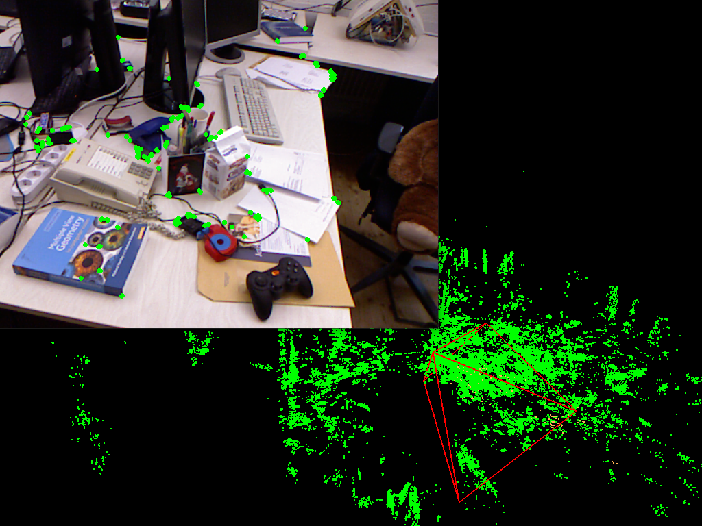
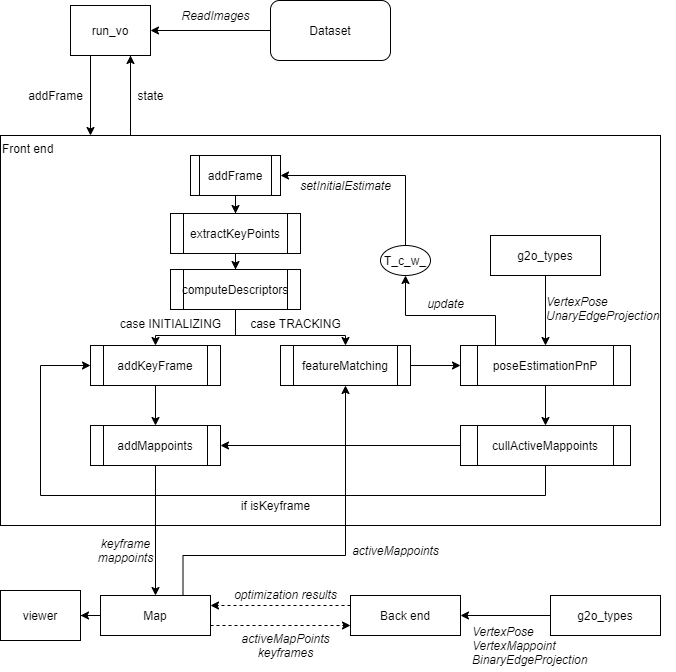

# RGBD_VisualOdometry

This repo is modified from gaoxiang12's [slambook/project/0.4](https://github.com/gaoxiang12/slambook/tree/master/project/0.4). This repo is a VO (Visual Odometry) for RGBD stream. It could track the camera's poses and the keypoints in space and render them with viz. 

## Requirements

* C++ 11
* CMake
* Opencv: 3.1
* Eigen3
* Sophus: commit [13fb328](https://github.com/strasdat/Sophus/tree/13fb3288311485dc94e3226b69c9b59cd06ff94e)
* G2O: commit [9b41a4e](https://github.com/RainerKuemmerle/g2o/tree/9b41a4ea5ade8e1250b9c1b279f3a9c098811b5a)
* Pangolin: commit [1ec721d](https://github.com/stevenlovegrove/Pangolin/tree/1ec721d59ff6b799b9c24b8817f3b7ad2c929b83)

## Dataset

[TUM dataset](https://vision.in.tum.de/data/datasets/rgbd-dataset/download)

## Work Flow

This repos is only a VO. It uses the following techniques. 

* Use `ORB` feature to extract features, descriptors
* Establish a local map to store space key-points and do the feature matching with new coming frame
    * Remove space points and add new space points to control the scale of the map
* Use 3D-2D to calculate the pose
    * Use `EPNP` to calculate the initial value of frame's pose
    * Use BA to estimate the final pose of the frame

The workflow is as the following image. 

Note. This VO is only the front end of SLAM. The keyframes could be used to do the optimization of backend, but they are not used in this repo.